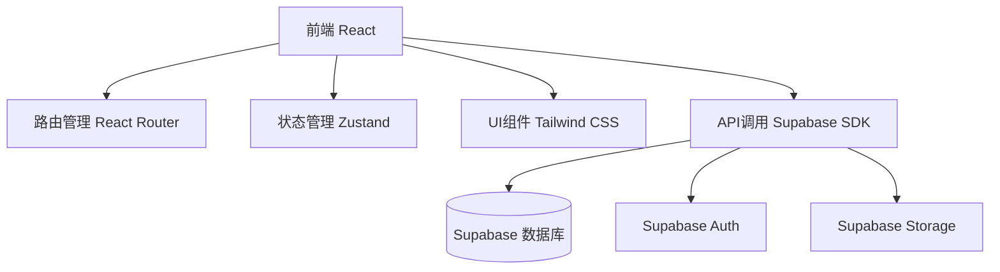
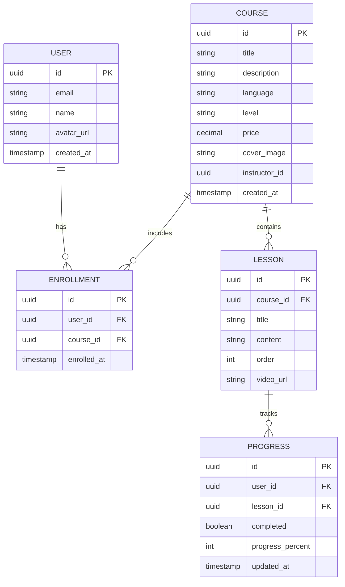

## 1. Architecture Design


## 2. Technology Description
- Frontend: React@18 + TypeScript + tailwindcss@3 + vite + react-router-dom + zustand
- Initialization Tool: vite-init
- Backend: Supabase (无需额外后端服务)
- Database: Supabase (PostgreSQL)

## 3. Route Definitions
| Route | Purpose |
|-------|---------|
| / | 首页 |
| /courses | 课程列表页 |
| /courses/:id | 课程详情页 |
| /learning | 学习中心页 |
| /profile | 个人中心页 |
| /login | 登录页 |
| /signup | 注册页 |

## 4. Data Model

### 4.1 Data Model Definition


### 4.2 Data Definition Language
```sql
-- 用户表 (使用 Supabase Auth 自带的 users 表)

-- 课程表
CREATE TABLE courses (
    id UUID DEFAULT gen_random_uuid() PRIMARY KEY,
    title VARCHAR(255) NOT NULL,
    description TEXT,
    language VARCHAR(50) NOT NULL,
    level VARCHAR(50) NOT NULL,
    price DECIMAL(10, 2) DEFAULT 0,
    cover_image VARCHAR(500),
    instructor_id UUID REFERENCES auth.users(id),
    created_at TIMESTAMP DEFAULT NOW()
);

-- 课时表
CREATE TABLE lessons (
    id UUID DEFAULT gen_random_uuid() PRIMARY KEY,
    course_id UUID REFERENCES courses(id) ON DELETE CASCADE,
    title VARCHAR(255) NOT NULL,
    content TEXT,
    "order" INT NOT NULL,
    video_url VARCHAR(500),
    created_at TIMESTAMP DEFAULT NOW()
);

-- 选课表
CREATE TABLE enrollments (
    id UUID DEFAULT gen_random_uuid() PRIMARY KEY,
    user_id UUID REFERENCES auth.users(id) ON DELETE CASCADE,
    course_id UUID REFERENCES courses(id) ON DELETE CASCADE,
    enrolled_at TIMESTAMP DEFAULT NOW(),
    UNIQUE(user_id, course_id)
);

-- 学习进度表
CREATE TABLE progress (
    id UUID DEFAULT gen_random_uuid() PRIMARY KEY,
    user_id UUID REFERENCES auth.users(id) ON DELETE CASCADE,
    lesson_id UUID REFERENCES lessons(id) ON DELETE CASCADE,
    completed BOOLEAN DEFAULT FALSE,
    progress_percent INT DEFAULT 0,
    updated_at TIMESTAMP DEFAULT NOW(),
    UNIQUE(user_id, lesson_id)
);

-- 创建索引
CREATE INDEX idx_courses_language ON courses(language);
CREATE INDEX idx_courses_level ON courses(level);
CREATE INDEX idx_lessons_course ON lessons(course_id);
CREATE INDEX idx_enrollments_user ON enrollments(user_id);
CREATE INDEX idx_progress_user_lesson ON progress(user_id, lesson_id);

-- 启用 RLS
ALTER TABLE courses ENABLE ROW LEVEL SECURITY;
ALTER TABLE lessons ENABLE ROW LEVEL SECURITY;
ALTER TABLE enrollments ENABLE ROW LEVEL SECURITY;
ALTER TABLE progress ENABLE ROW LEVEL SECURITY;

-- RLS 策略
CREATE POLICY "courses_select_all" ON courses FOR SELECT USING (true);
CREATE POLICY "lessons_select_all" ON lessons FOR SELECT USING (true);
CREATE POLICY "enrollments_select_own" ON enrollments FOR SELECT USING (auth.uid() = user_id);
CREATE POLICY "enrollments_insert_own" ON enrollments FOR INSERT WITH CHECK (auth.uid() = user_id);
CREATE POLICY "progress_select_own" ON progress FOR SELECT USING (auth.uid() = user_id);
CREATE POLICY "progress_insert_own" ON progress FOR INSERT WITH CHECK (auth.uid() = user_id);
CREATE POLICY "progress_update_own" ON progress FOR UPDATE USING (auth.uid() = user_id);

-- 授予权限
GRANT SELECT ON courses TO anon, authenticated;
GRANT SELECT ON lessons TO anon, authenticated;
GRANT ALL ON enrollments TO authenticated;
GRANT ALL ON progress TO authenticated;
```