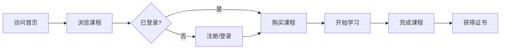

## 1. Product Overview
外语学习平台，提供在线课程、互动练习和学习进度追踪，帮助用户提升英语、日语、法语等多种语言能力。
- 目标用户：学生、职场人士、语言爱好者
- 市场价值：打破传统语言学习的时空限制，提供个性化、高效的学习体验

## 2. Core Features

### 2.1 User Roles
| Role | Registration Method | Core Permissions |
|------|---------------------|------------------|
| 普通用户 | 邮箱/手机号注册 | 浏览课程、购买课程、学习课程、查看进度 |
| 管理员 | 后台管理 | 课程管理、用户管理、订单管理 |

### 2.2 Feature Module
1. **首页**：英雄区域、热门课程推荐、学习路径介绍
2. **课程列表页**：课程分类、筛选、搜索、课程卡片
3. **课程详情页**：课程介绍、课程大纲、讲师信息、价格购买
4. **学习中心页**：我的课程、学习进度、练习记录
5. **个人中心页**：个人信息、账户设置、订单历史

### 2.3 Page Details
| Page Name | Module Name | Feature description |
|-----------|-------------|---------------------|
| 首页 | 英雄区域 | 醒目的标题、CTA按钮、背景动画 |
| 首页 | 热门课程 | 轮播展示精选课程，点击查看详情 |
| 首页 | 学习路径 | 展示不同语言水平的学习路径 |
| 首页 | 用户评价 | 真实用户的学习体验和评价 |
| 课程列表页 | 分类筛选 | 按语言、难度、价格等条件筛选 |
| 课程详情页 | 课程预览 | 视频/音频预览功能 |
| 学习中心页 | 进度追踪 | 可视化展示学习进度和统计 |
| 个人中心页 | 账户管理 | 个人资料编辑、密码修改 |

## 3. Core Process
用户访问平台 → 浏览课程 → 注册/登录 → 购买课程 → 开始学习 → 完成课程 → 获得证书

## 4. User Interface Design
### 4.1 Design Style
- 主色：深蓝色 (#1e3a8a) 和金色 (#f59e0b)，传达专业和信任感
- 按钮：圆角、渐变效果，悬停时有微妙的缩放动画
- 字体：使用 Playfair Display（标题）和 Source Sans Pro（正文）
- 布局：卡片式布局，清晰的信息层级，大量留白
- 图标：使用线条风格，与整体设计保持一致

### 4.2 Page Design Overview
| Page Name | Module Name | UI Elements |
|-----------|-------------|-------------|
| 首页 | 英雄区域 | 大型渐变背景、动画标题、浮动CTA按钮 |
| 首页 | 课程卡片 | 卡片悬停效果、课程信息层级分明 |
| 课程详情页 | 课程预览 | 视频播放器、进度条、播放控制 |
| 学习中心页 | 进度图表 | 线性进度条、圆环图、动画加载效果 |

### 4.3 Responsiveness
采用移动优先的响应式设计，适配桌面端（1200px+）、平板（768px-1199px）和手机（767px以下），确保在所有设备上都有良好的用户体验。